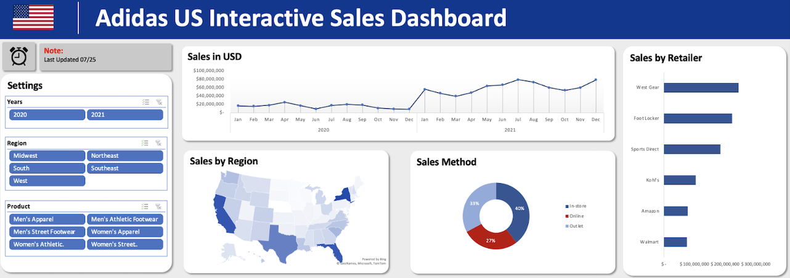

# Portfolio
---

## Amazon Reviews Sentiment Analysis

### NLP Reviews Analysis

Using over 50,000 Amazon reviews, I conducted sentiment analysis in python using VADER (Valence Aware Dictionary and Entiment Reasoner) using the "bag of words" approach.  With the Natural Language Toolkit (NLTK), VADER Sentiment Scoring was used to assign scores to the reviews.  These reviews were then plotted to show the varying overall sentiment scores of 1-5 star reviews.

## Wine Quality Report

### Machine Learning Analysis of Red Wine Quality

**Learning Outcomes:** Implemented machine learning techniques such as linear regression with gradient descent and ordinary least squares (OLS), and developed a Multilayer Perceptron (MLP) using scikitlearn to analyze and interpret data regarding wine quality.  Employed analysis methods utilizing test and training data, examining critical components such as fixed acidity, citric acid, residual sugar, pH, and sulphates to accurately predict alcohol content in red wine.

## Data Visualizations In Excel

### Interactive Sales Dashboards

Designed engaging and interactive sales dashboards, featuring hyperlinks to navigate between different tabs and highlighting key performance indicators (KPIs).
Produced a range of dynamic charts and visuals, including a map chart, radar chart, line
chart and doughnut chart to provide critical insights into a company's strategic, financial,
and operational performance

© 2023 Michael Torres. Powered by Jekyll and the Minimal Theme.

